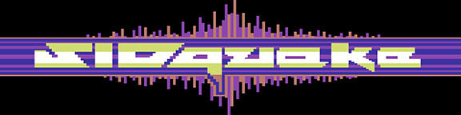
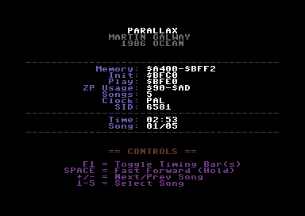
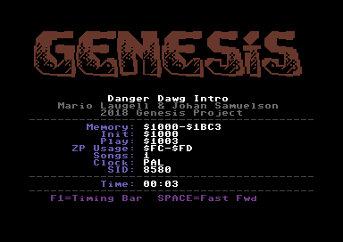
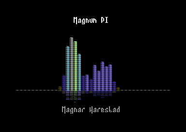
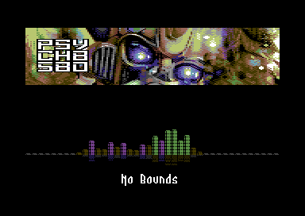
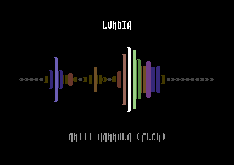
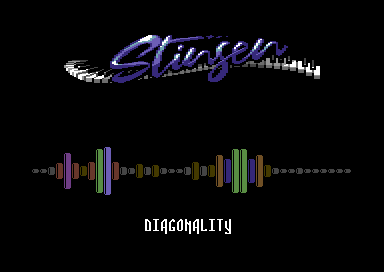
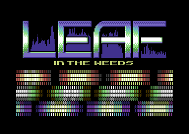
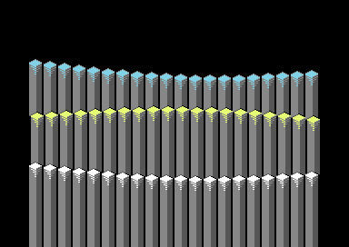
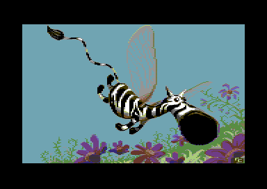

# SIDquake

*C64 SID Music Analyzer, Linker & PRG Builder*

<p align="center"></p>

Developed by Robert Troughton (Raistlin of [Genesis Project](https://c64demo.com)) — live at **[sidquake.c64demo.com](https://sidquake.c64demo.com)**

## What is SIDquake?

SIDquake is a web-based tool for working with Commodore 64 SID music files. Drop in a .sid file and SIDquake will:

- **Play** it in the browser through libsidplayfp / reSIDfp — a full cycle-accurate C64, so RSID tunes, sample players and raster-timed effects sound exactly as they do on hardware
- **Analyze** the tune using a 6510 CPU emulator running in WebAssembly
- **Display** detailed technical info: memory usage, SID register writes, CIA timers, multi-SID detection
- **Build executable C64 PRGs** with your choice of visualizer effect, custom logos, and metadata
- **Browse HVSC** (High Voltage SID Collection), self-hosted here and searchable by title, author and STIL text

No plugins, no installs — runs entirely in your browser.

## Visualizers

SIDquake ships 10 visualizer templates that can be linked with any SID tune to create a standalone C64 executable. Each preview below is the same image the app shows in its visualizer picker.

<table>
<tr>
<td width="50%"><br/><b>Default</b><br/>Minimal player with textual information</td>
<td width="50%"><br/><b>Default With Logo</b><br/>Text information with a 9-row logo (charset, bitmap or PETSCII)</td>
</tr>
<tr>
<td><br/><b>Raistlin Bars</b><br/>Full-height spectrum bars</td>
<td><br/><b>Raistlin Bars With Logo</b><br/>Spectrum bars below an 80px tall logo</td>
</tr>
<tr>
<td><br/><b>Raistlin Mirror Bars</b><br/>Mirrored spectrum bars</td>
<td><br/><b>Raistlin Mirror Bars With Logo</b><br/>Mirrored bars below an 80px tall logo</td>
</tr>
<tr>
<td><br/><b>Musical Blobs</b><br/>Per-channel spectrum painted as 80 vertical colour strips into a bitmap, below a character-set logo</td>
<td><br/><b>Scrap Columns</b><br/>3D column spectrum visualizer by Scrap</td>
</tr>
<tr>
<td><br/><b>Simple Bitmap</b><br/>Full-screen bitmap, with an optional scroller</td>
<td><br/><b>Simple Raster</b><br/>Minimal rasterbar effect</td>
</tr>
</table>

### Bar generation methods

The four Raistlin Bars variants are each built three ways, and the **Method** tab picks between them at export time:

| Method | How the bars are made | Trade-off |
|--------|----------------------|-----------|
| **Spectrometer** | A true FFT of the rendered audio, vector-quantized and baked into the file | Looks best, lowest runtime CPU, perfect sound — but a larger file, and one song only |
| **VU meter · Clever** | Notes + an ADSR approximation, generated live, using a save/restore trick so the analysis peek can't disturb the tune | Perfect sound and full multi-song support, at the cost of two play calls per frame |
| **VU meter · Shadow** | The same note-based bars captured with a lighter single-play redirect | Lowest CPU and smallest file; sound quality may be affected |

See [SIDPlayers/BAR_HEIGHT_METHODS.md](SIDPlayers/BAR_HEIGHT_METHODS.md) for the implementation detail.

## Features

### SID Playback
- libsidplayfp with the reSIDfp chip emulator, compiled to WebAssembly, with embedded KERNAL/BASIC/CHARGEN ROMs
- Real C64 environment (CPU, CIA, VIC-II), so RSID tunes and sample players play correctly
- Live spectrum visualizer driven from the playback signal

### SID Analysis
- Full 6510 CPU emulation via WebAssembly for accurate analysis
- Memory map visualization showing code vs data regions
- SID register write tracking across all voices
- Multi-SID chip detection (2SID, 3SID)
- CIA timer analysis for non-standard play routines
- Zero-page usage tracking

### PRG Export
- Automatic memory layout planning to avoid collisions between music and player code
- Most players are relocatable and are placed wherever they fit; the rest ship as fixed builds at $4000, $8000 and $C000, chosen automatically
- Exomizer or TSCrunch compression for smaller executables (Exomizer is the default and packs ~9-16% tighter; TSCrunch depacks ~4x faster)
- Custom metadata: edit song title, author, and copyright before export
- Custom logos: import PNG or Koala images, or use PETSCII text art
- Bar style and colour effect customization for spectrum visualizers (height pulse, fixed gradients, rainbow columns, per-waveform colouring)

### Image Conversion
- PNG to C64 multicolor bitmap conversion with palette matching
- PNG to charset/PETSCII logo conversion (CharSet Lab engine: PETSCII, hires, multicolour and ECM modes, with sub-character alignment search)
- 116 authentic C64 color palettes (VICE, Pepto, Colodore, Pixcen, and more)
- Galleries of pre-made logos, bitmaps and fonts, each credited to its artist

### HVSC Browser
- Browse the complete High Voltage SID Collection, self-hosted rather than proxied
- Search across title, author, release and folded STIL comment text, straight from an in-memory index (no per-folder network calls)
- Load any tune directly into the analyzer
- Random tune picker, optionally biased toward a curated list
- Embeddable as an iframe widget for other sites — see the **Embed HVSC** tab

## How It Works

1. **Load** a .sid file (drag-drop, file picker, or browse HVSC)
2. **Analyze** — SIDquake emulates thousands of frames of 6510 execution to map memory usage and SID register patterns
3. **Choose** a visualizer template and customize options (logo, colors, bar style, bar generation method)
4. **Export** a .prg file ready to run on real C64 hardware or in an emulator (VICE, etc.)

## Development

### Prerequisites

- Java (for KickAss assembler)
- Python 3 (for frequency table generation)
- Node.js (for the HVSC extract/index scripts and dev dependencies)
- Emscripten SDK (only when rebuilding the WASM modules)
- **git-lfs** — the committed HVSC archive under `hvsc-data/` is stored in Git LFS

### Building

```
0-build.bat
```

This runs three steps:
1. Generates frequency lookup tables for spectrum analyzers
2. Compiles all SID player assembly to .bin files via KickAss
3. Compiles the WASM modules from C/C++ via Emscripten

On Linux/CI the WASM modules are built by `scripts/build-sidplayfp-wasm.sh` and
`scripts/build-exomizer-wasm.sh`.

### HVSC data

The raw .sid files are not committed. Extract them from the committed archive once:

```
npm run extract-hvsc          # unpacks hvsc-data/*.7z into public/HVSC/
npm run build-hvsc-index      # regenerates public/hvsc-index.json
```

### Running Locally

```
1-runserver.bat
```

Or use any static file server pointing at the `public/` directory.

### Project Structure

```
public/           Web frontend (vanilla JS, no framework or build step)
wasm/             C sources for the WASM modules (6510 emulator, SID processor,
                  PNG converter, libsidplayfp, Exomizer)
SIDPlayers/       C64 assembly source for visualizer player routines
scripts/          HVSC extraction, SEO/share-metadata generation, WASM build scripts
tools/            HVSC index builder
hvsc-data/        Committed HVSC archive (Git LFS)
netlify/          Edge functions: HVSC access gating and per-tune share cards
docs/             Architecture documentation
```

See [docs/ARCHITECTURE.md](docs/ARCHITECTURE.md) for detailed component documentation.

## Technology

- **Frontend**: Vanilla JavaScript with ES6 classes — no framework, no bundler, no build step for JS
- **Playback**: libsidplayfp + reSIDfp compiled to WebAssembly (`sidplayfp.wasm`), with real C64 ROMs
- **Emulation**: MOS 6510 CPU emulator compiled to WebAssembly for analysis (`sidquake.wasm`)
- **Assembly**: KickAss assembler for C64 player routines
- **Compression**: Exomizer (WebAssembly, default) and TSCrunch (JavaScript port) for self-extracting C64 executables
- **Hosting**: Netlify; the HVSC collection is self-hosted, with edge functions gating raw SID access and generating per-tune share cards

## Acknowledgements

- **libsidplayfp** and **reSIDfp** (Simon White, Antti Lankila, Leandro Nini and contributors) — the in-browser SID playback engine
- **reSID** (Dag Lem) — the original SID emulation the above build on, and the legacy playback path
- Philip Timmermann (Pepto) for the SIDquake logo
- Scrap for the Scrap Columns visualizer, adapted for SIDquake
- Mads Nielsen for KickAss assembler
- Antonio Savona for the TSCrunch compression algorithm
- Magnus Lind for Exomizer
- The VICE team for the C64 ROM images used by the playback engine
- The C64 graphicians whose artwork fills the logo and bitmap galleries — each piece is credited by name in the gallery
- Adam Dunkels (Trident), Andy Zeidler (Shine), Burglar and Magnar Harestad for help and testing
- The HVSC Crew, the STIL editors, and the composers of every tune in the collection

## License

The in-browser playback engine incorporates **libsidplayfp** and **reSID /
reSIDfp**, which are licensed under the **GNU General Public License, version 2
or later**. Because those components are compiled into the WebAssembly binaries
that SIDquake serves to every visitor, the WASM audio engine and the C++ sources
under `wasm/` that are linked into it are also **GPL v2-or-later** — see
[`LICENSE`](LICENSE). The corresponding source (including the build scripts) is
published in this repository.

The surrounding JavaScript/HTML/CSS front end talks to the WASM modules across a
runtime `cwrap`/`ccall` boundary and is © Robert Troughton.

Third-party components and their licenses are listed in
[`THIRD-PARTY-NOTICES.md`](THIRD-PARTY-NOTICES.md). Note that the embedded C64
KERNAL/BASIC/CHARGEN ROMs remain the property of Commodore/Cloanto and are not
covered by SIDquake's license (see [`roms/README.md`](roms/README.md)).
